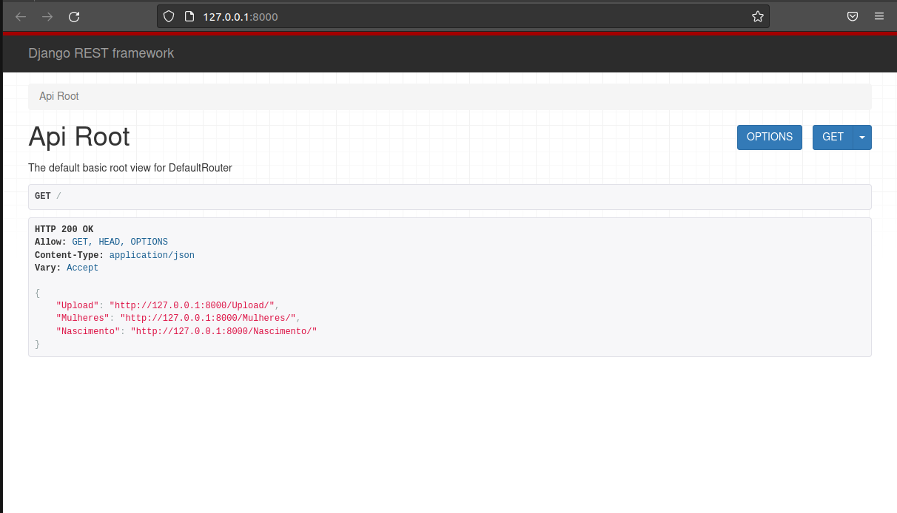

# Upload (Consumindo Arquivo)



> O intuito desse Projeto é carregar um arquivo xlsx, pegar os dados e colocar no banco, e buscar os dados filtrados.

* [Demostração em Vídeo](https://drive.google.com/file/d/16pbhGarpLmSUhkxluq0BqtAS_53I-xN1/view?usp=share_link)

🏫 Atividade acâdemica

## Tecnologias Utilizadas


## 🚀 Processo de Instalação

Para instalar **Upload**, siga estas etapas:

Linux:
```
git clone https://github.com/Wenderson-Oscar/Upload.git
virtualenv env
. env/bin/activate
pip install -r requirements.txt
```

Windows:
```
git clone https://github.com/Wenderson-Oscar/Upload.git
python -m venv env
env\Scripts\activate
pip install -r requirements.txt
```

## ☕ Como Utlizar a Aplicação

Para usar **Upload**, siga estas etapas:

```
python manage.py migrate upload
python manage.py migrate
python manage.py createsuperuser
python manage.py runserver
```

